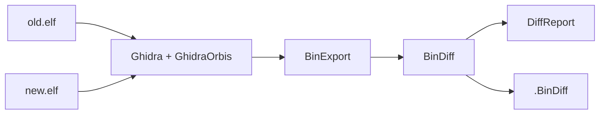
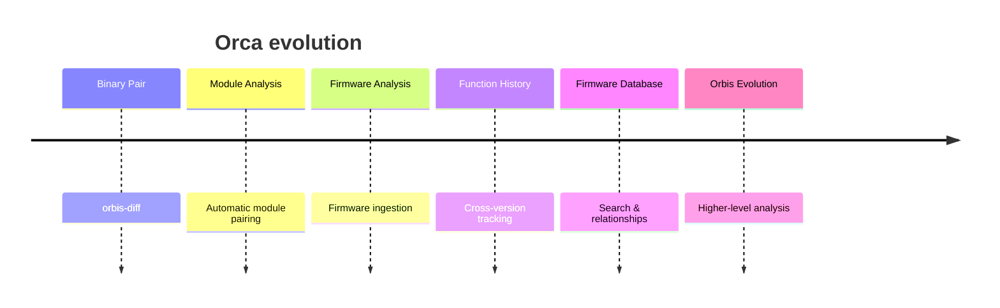

<h1 align="center">Orca</h1>

<p align="center">
  
</p>

<p align="center">
  <a href="https://github.com/curl-s/Orca/stargazers">
    
  </a>
  <a href="https://github.com/curl-s/Orca/issues">
    
  </a>
  <a href="https://github.com/curl-s/Orca/releases">
    
  </a>
  <a href="https://github.com/curl-s/Orca/blob/main/LICENSE">
    
  </a>
</p>

<p align="center">
  <b>Beyond binary diffing. Understand firmware evolution.</b>
</p>

---

**Orca** is a reverse-engineering toolkit for **PlayStation 4 / Orbis OS firmware**.

The long-term goal is to track how Orbis components, functions, and modules evolve across firmware versions.

> **Current milestone:** `orbis-diff` — function-level diffing between two decrypted Orbis binaries.

---

## `orbis-diff`

A lightweight wrapper around existing reverse-engineering tools rather than another disassembler or diff engine.



```bash
orbis-diff old.elf new.elf
```

### Output

```text
old.elf -> new.elf

Overall similarity: 91.2%
Confidence: 88.4%

Matched: 512
  Identical: 498
  Modified: 14

Added:   3
Removed: 1
```

| Result   | Description               |
| -------- | ------------------------- |
| Matched  | Function exists in both   |
| Modified | Function changed          |
| Added    | Only exists in new binary |
| Removed  | Only exists in old binary |

---

## MVP Scope

| Feature                       | Status |
| ----------------------------- | :----: |
| Two-binary diffing            |   🗸   |
| Ghidra headless               |   🗸   |
| GhidraOrbis                   |   🗸   |
| BinExport                     |   🗸   |
| BinDiff                       |   🗸   |
| Function changes              |   🗸   |
| `.BinDiff` artifacts          |   🗸   |
| Firmware database             |    ~   |
| Multi-version tracking        |    ~   |
| Web UI                        |    ~   |
| Automatic firmware extraction |    ~   |
| Vulnerability detection       |    —   |

The MVP deliberately focuses on getting **one binary pair through the complete pipeline reliably**.

---

## Future



The goal is to move from:

**“What changed between these two binaries?”**

to:

**“How did this component evolve across Orbis history?”**

---

## Requirements

| Dependency   | Purpose            |
| ------------ | ------------------ |
| Python 3.10+ | Runtime            |
| Ghidra       | Binary analysis    |
| GhidraOrbis  | Orbis loading      |
| BinExport    | Ghidra → BinExport |
| BinDiff      | Binary comparison  |

### Installation

```bash
git clone https://github.com/curl-s/Orca.git
cd Orca

pip install -r requirements.txt
pip install -e .
```

---

## Configuration

| Variable                         | Purpose                |
| -------------------------------- | ---------------------- |
| `GHIDRA_INSTALL_DIR`             | Ghidra installation    |
| `GHIDRA_HEADLESS`                | `analyzeHeadless` path |
| `GHIDRA_ORBIS_LOADER`            | Orbis loader override  |
| `BINEXPORT_SCRIPT_PATH`          | BinExport script       |
| `BINDIFF_PATH`                   | BinDiff / `differ`     |
| `ORBIS_DIFF_WORKDIR`             | Scratch directory      |
| `ORBIS_DIFF_IDENTICAL_THRESHOLD` | Identical threshold    |

---

## Status

**Early development.**

`orbis-diff` is the foundation for the larger Orca project.

> **Two binaries in. A structured diff out.**
